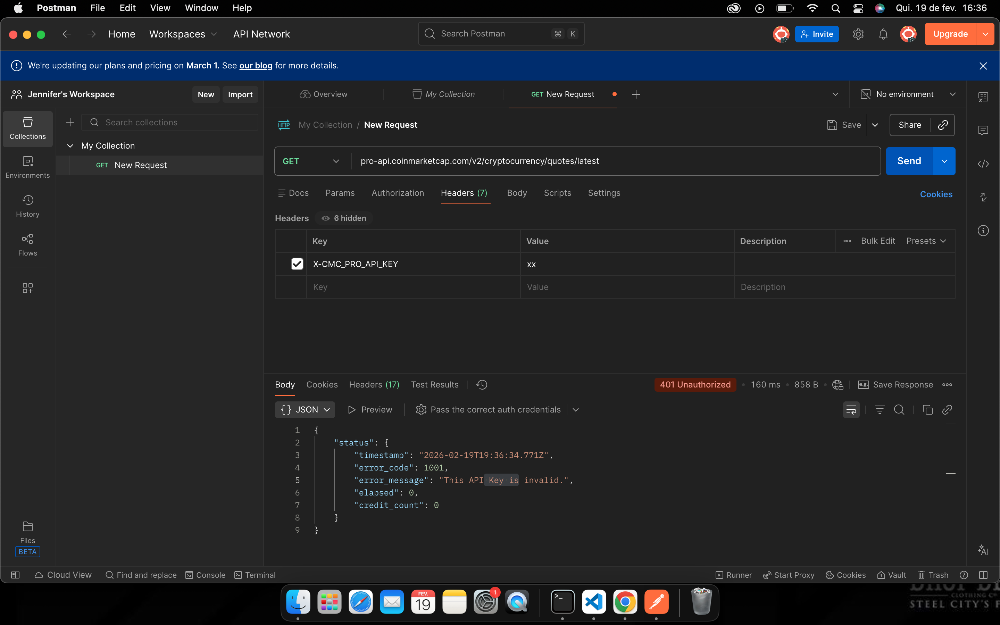
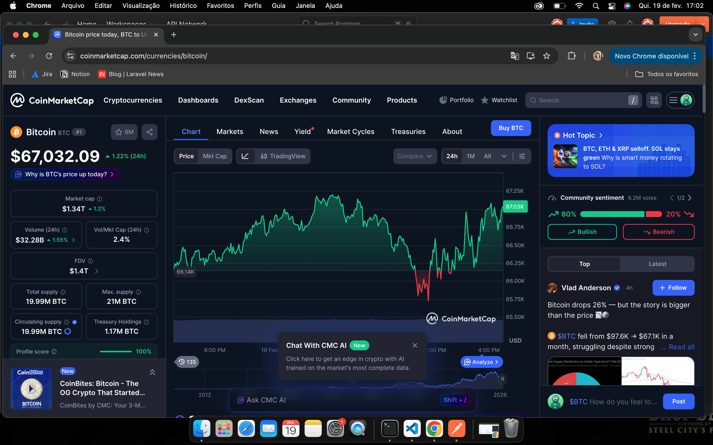
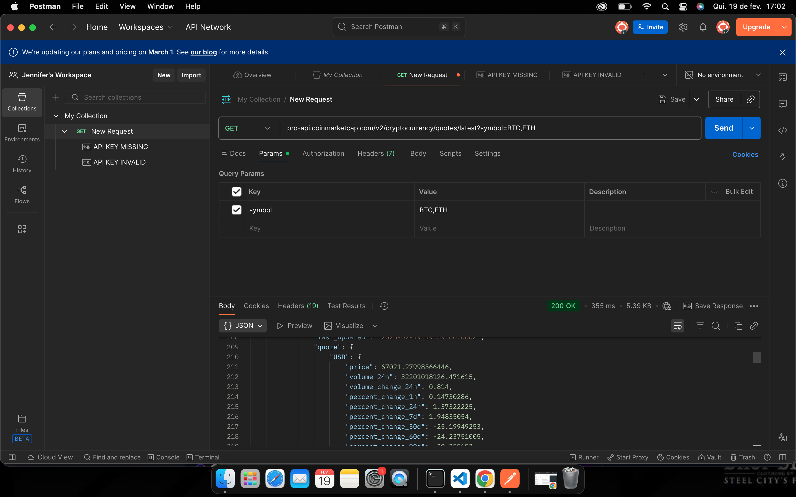
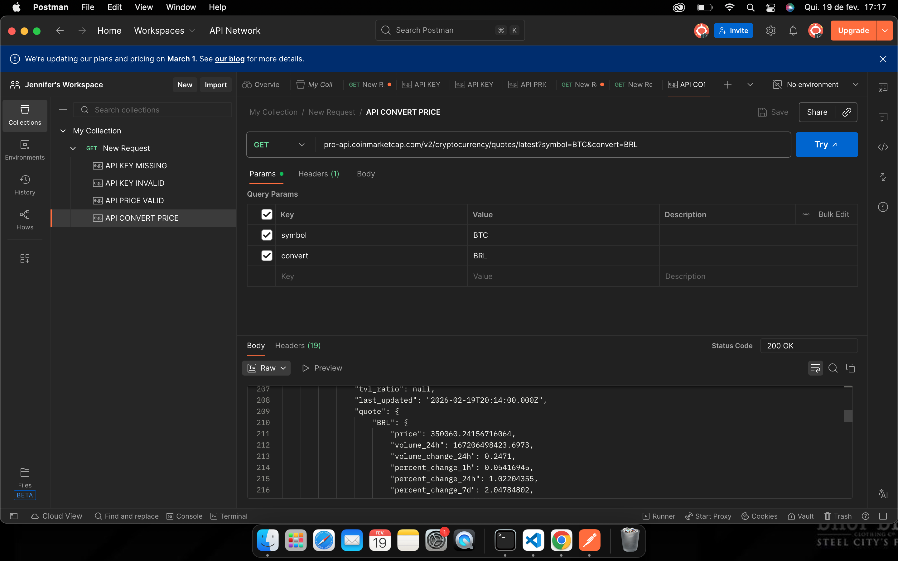
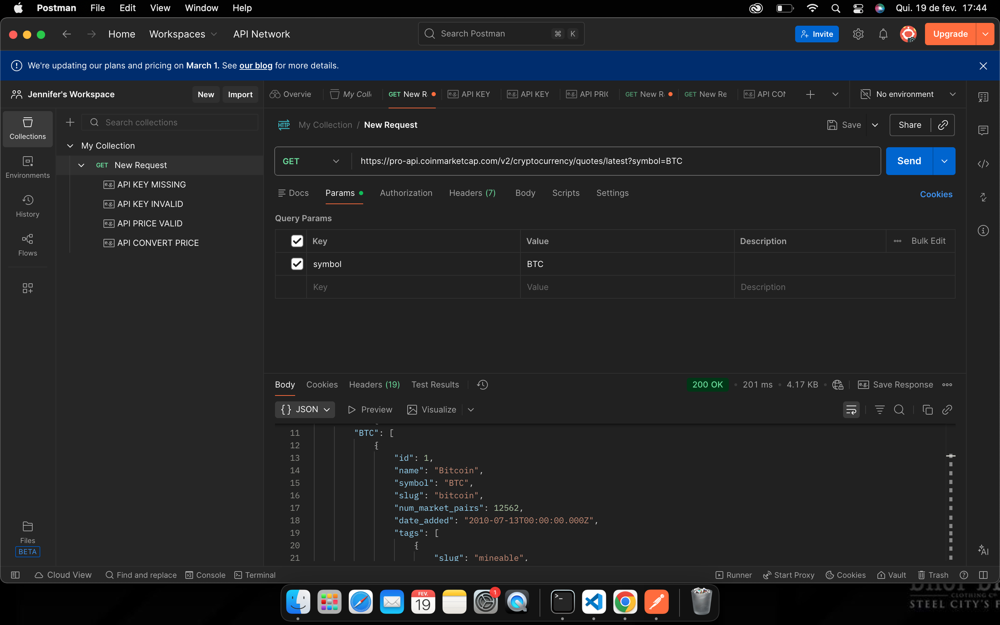
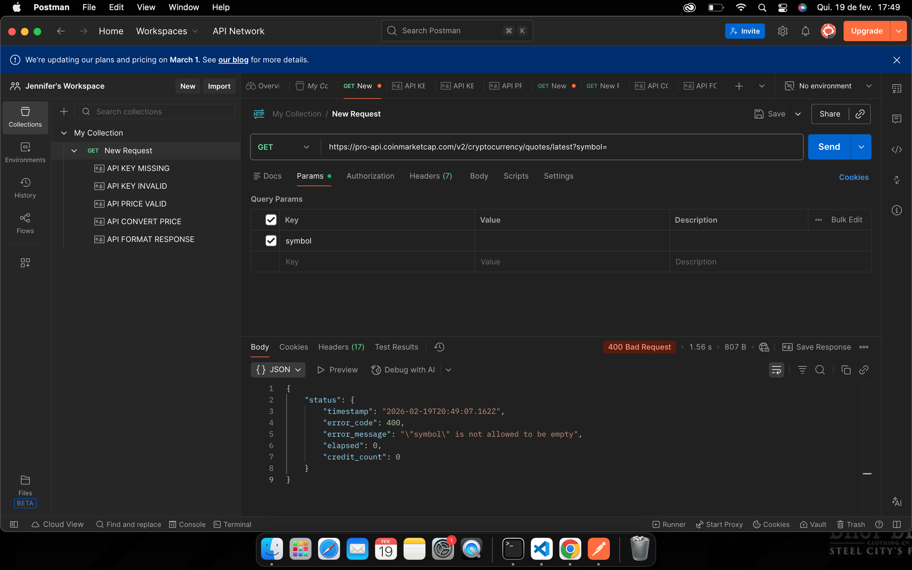
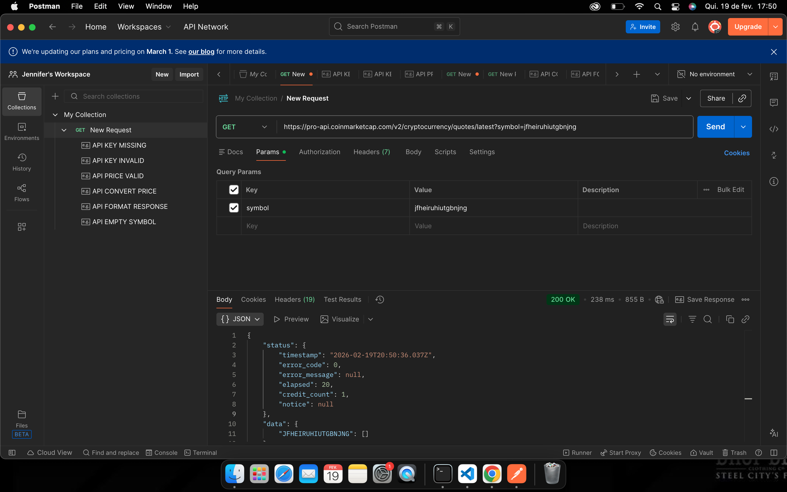

##  Sobre o Projeto

Este projeto contém testes manuais de API realizados na plataforma CoinMarketCap, utilizando a ferramenta Postman.

O objetivo foi praticar testes de API como QA Júnior, validando regras de negócio, segurança, respostas da API e tratamento de erros.

---

##  Ferramentas Utilizadas

- Postman
- API CoinMarketCap (https://coinmarketcap.com/api/documentation/v1/#operation/getV2CryptocurrencyQuotesLatest)

---

##  Endpoints Testados

- https://pro-api.coinmarketcap.com/v2/cryptocurrency/quotes/latest

---

## Cenários de testes

<table>
  <tr>
   <td>ID:
   </td>
   <td>1
   </td>
  </tr>
  <tr>
   <td>Endpoint:
   </td>
   <td>pro-api.coinmarketcap.com/v2/cryptocurrency/quotes/latest
   </td>
  </tr>
  <tr>
   <td>Método:
   </td>
   <td>Get
   </td>
  </tr>
  <tr>
   <td>Cenário:
   </td>
   <td>Acessar API com API KEY inválida
   </td>
  </tr>
  <tr>
   <td>Parâmetros:
   </td>
   <td>
   </td>
  </tr>
  <tr>
   <td>Resultado Esperado:
   </td>
   <td>Retornar erro de requisição inválida
   </td>
  </tr>
  <tr>
   <td>Resultado Obtido:
   </td>
   <td><code>{</code>

<code>   "status": {</code>

<code>       "timestamp": "2026-02-19T19:37:21.882Z",</code>

<code>       "error_code": 1001,</code>

<code>       "error_message": "This API Key is invalid.",</code>

<code>       "elapsed": 0,</code>

<code>       "credit_count": 0</code>

<code>   }</code>

<code>}</code>
   </td>
  </tr>
  <tr>
   <td>Status:
   </td>
   <td>APROVADO 
   </td>
  </tr>

  <tr>
   <td>Evidência:
   </td>
   <td>
       
   </td>
  </tr>

</table>

<table>
  <tr>
   <td>ID:
   </td>
   <td>2
   </td>
  </tr>
  <tr>
   <td>Endpoint:
   </td>
   <td>pro-api.coinmarketcap.com/v2/cryptocurrency/quotes/latest
   </td>
  </tr>
  <tr>
   <td>Método:
   </td>
   <td>Get
   </td>
  </tr>
  <tr>
   <td>Cenário:
   </td>
   <td>Acessar API com campo vazio na API KEY 
   </td>
  </tr>
  <tr>
   <td>Parâmetros:
   </td>
   <td>
   </td>
  </tr>
  <tr>
   <td>Resultado Esperado:
   </td>
   <td>Retornar erro de mensagem de formato inválido
   </td>
  </tr>
  <tr>
   <td>Resultado Obtido:
   </td>
   <td><code>{</code>

<code>    "status": {</code>

<code>        "timestamp": "2026-02-19T19:36:57.128Z",</code>

<code>        "error_code": 1002,</code>

<code>        "error_message": "API key missing.",</code>

<code>        "elapsed": 0,</code>

<code>        "credit_count": 0</code>

<code>    }</code>

<code>}</code>
   </td>
  </tr>
  <tr>
   <td>Status:
   </td>
   <td>APROVADO 
   </td>
  </tr>
  <tr>
   <td>Evidência:
   </td>
   <td>
       
   </td>
  </tr>
</table>

<table>
  <tr>
   <td>ID:
   </td>
   <td>3
   </td>
  </tr>
  <tr>
   <td>Endpoint:
   </td>
   <td>pro-api.coinmarketcap.com/v2/cryptocurrency/quotes/latest
   </td>
  </tr>
  <tr>
   <td>Método:
   </td>
   <td>Get
   </td>
  </tr>
  <tr>
   <td>Cenário:
   </td>
   <td>Consultar o preço de uma criptomoeda e validar o valor com o site
   </td>
  </tr>
  <tr>
   <td>Parâmetros:
   </td>
   <td>symbol=BTC,ETH
   </td>
  </tr>
  <tr>
   <td>Resultado Esperado:
   </td>
   <td>Retorne preço corretamente
   </td>
  </tr>
  <tr>
   <td>Resultado Obtido:
   </td>
   <td><code> "USD": {</code>

<code>                        "price": 67021.27998566446,</code>

<code>}</code>
   </td>
  </tr>
  <tr>
   <td>Status:
   </td>
   <td>APROVADO 
   </td>
  </tr>
  <tr>
   <td>Evidência:
   </td>
   <td>
       
     
   </td>
  </tr>
</table>

<table>
  <tr>
   <td>ID:
   </td>
   <td>4
   </td>
  </tr>
  <tr>
   <td>Endpoint:
   </td>
   <td>pro-api.coinmarketcap.com/v2/cryptocurrency/quotes/latest
   </td>
  </tr>
  <tr>
   <td>Método:
   </td>
   <td>Get
   </td>
  </tr>
  <tr>
   <td>Cenário:
   </td>
   <td>Consultar o preço de uma criptomoeda e converter o valor em moeda fiduciária
   </td>
  </tr>
  <tr>
   <td>Parâmetros:
   </td>
   <td>symbol=BTC/ convert=BRL
   </td>
  </tr>
  <tr>
   <td>Resultado Esperado:
   </td>
   <td>Retorne valor convertido corretamente
   </td>
  </tr>
  <tr>
   <td>Resultado Obtido:
   </td>
   <td><code>"quote": {</code>

<code>                   "BRL": {</code>

<code>                       "price": 350065.80569959665,</code>
   </td>
  </tr>
  <tr>
   <td>Status:
   </td>
   <td>APROVADO 
   </td>
  </tr>
  <tr>
   <td>Evidência:
   </td>
   <td>
       
   </td>
  </tr>
</table>

<table>
  <tr>
   <td>ID:
   </td>
   <td>5
   </td>
  </tr>
  <tr>
   <td>Endpoint:
   </td>
   <td>pro-api.coinmarketcap.com/v2/cryptocurrency/quotes/latest
   </td>
  </tr>
  <tr>
   <td>Método:
   </td>
   <td>Get
   </td>
  </tr>
  <tr>
   <td>Cenário:
   </td>
   <td>Validar formatos nas respostas da API se condizem com a documentação
   </td>
  </tr>
  <tr>
   <td>Parâmetros:
   </td>
   <td>symbol=BTC
   </td>
  </tr>
  <tr>
   <td>Resultado Esperado:
   </td>
   <td>Formato retorna exatamente conforme descrito na documentação
   </td>
  </tr>
  <tr>
   <td>Resultado Obtido:
   </td>
   <td><code>"BTC": [</code>

<code>           {</code>

<code>               "id": 1,</code>

<code>               "name": "Bitcoin",</code>

<code>               "symbol": "BTC",</code>

<code>               "slug": "bitcoin",</code>

<code>               "num_market_pairs": 12562,</code>

<code>               "date_added": "2010-07-13T00:00:00.000Z",</code>

<code>               "tags": [</code>

<code>                 …</code>

<code>               ],</code>

<code>               "max_supply": 21000000,</code>

<code>               "circulating_supply": 19992006,</code>

<code>               "total_supply": 19992006,</code>

<code>               "is_active": 1,</code>

<code>               "infinite_supply": false,</code>

<code>               "minted_market_cap": 1339180744008.09,</code>

<code>               "platform": null,</code>

<code>               "cmc_rank": 1,</code>

<code>               "is_fiat": 0,</code>

<code>               "self_reported_circulating_supply": null,</code>

<code>               "self_reported_market_cap": null,</code>

<code>               "tvl_ratio": null,</code>

<code>               "last_updated": "2026-02-19T20:35:00.000Z",</code>

<code>               "quote": {</code>

<code>                   "USD": {</code>

<code>                       "price": 66985.81142923291,</code>

<code>                       "volume_24h": 32142817352.32578,</code>

<code>                       "volume_change_24h": 0.5372,</code>

<code>                       "percent_change_1h": 0.14967025,</code>

<code>                       "percent_change_24h": 0.85585978,</code>

<code>                       "percent_change_7d": 2.26595325,</code>

<code>                       "percent_change_30d": -25.16908177,</code>

<code>                       "percent_change_60d": -24.12589059,</code>

<code>                       "percent_change_90d": -19.99924961,</code>

<code>                       "market_cap": 1339180744008.093,</code>

<code>                       "market_cap_dominance": 58.3193,</code>

<code>                       "fully_diluted_market_cap": 1406702040013.89,</code>

<code>                       "tvl": null,</code>

<code>                       "last_updated": "2026-02-19T20:35:00.000Z"</code>

<code>                   }</code>

<code>               }</code>

<code>           },</code>
   </td>
  </tr>
  <tr>
   <td>Status:
   </td>
   <td>APROVADO 
   </td>
  </tr>
  <tr>
   <td>Evidência:
   </td>
   <td>
       
   </td>
  </tr>
</table>

<table>
  <tr>
   <td>ID:
   </td>
   <td>6
   </td>
  </tr>
  <tr>
   <td>Endpoint:
   </td>
   <td>pro-api.coinmarketcap.com/v2/cryptocurrency/quotes/latest
   </td>
  </tr>
  <tr>
   <td>Método:
   </td>
   <td>Get
   </td>
  </tr>
  <tr>
   <td>Cenário:
   </td>
   <td>Verificar o preço de uma moeda com campo symbol vazio
   </td>
  </tr>
  <tr>
   <td>Parâmetros:
   </td>
   <td>symbol=
   </td>
  </tr>
  <tr>
   <td>Resultado Esperado:
   </td>
   <td>Retorna erro com mensagem de campo vazio
   </td>
  </tr>
  <tr>
   <td>Resultado Obtido:
   </td>
   <td><code>{</code>

<code>    "status": {</code>

<code>        "timestamp": "2026-02-19T20:49:07.162Z",</code>

<code>        "error_code": 400,</code>

<code>        "error_message": "\"symbol\" is not allowed to be empty",</code>

<code>        "elapsed": 0,</code>

<code>        "credit_count": 0</code>

<code>    }</code>

<code>}</code>
   </td>
  </tr>
  <tr>
   <td>Status:
   </td>
   <td>APROVADO 
   </td>
  </tr>
  <tr>
   <td>Evidência:
   </td>
   <td>
       
   </td>
  </tr>
</table>

<table>
  <tr>
   <td>ID:
   </td>
   <td>7
   </td>
  </tr>
  <tr>
   <td>Endpoint:
   </td>
   <td>pro-api.coinmarketcap.com/v2/cryptocurrency/quotes/latest
   </td>
  </tr>
  <tr>
   <td>Método:
   </td>
   <td>Get
   </td>
  </tr>
  <tr>
   <td>Cenário:
   </td>
   <td>Verificar o preço de uma moeda com campo symbol inválido
   </td>
  </tr>
  <tr>
   <td>Parâmetros:
   </td>
   <td>symbol=JFHEIRUHIUTGBNJNG
   </td>
  </tr>
  <tr>
   <td>Resultado Esperado:
   </td>
   <td>Retorne erro 
   </td>
  </tr>
  <tr>
   <td>Resultado Obtido:
   </td>
   <td><code>{</code>

<code>    "status": {</code>

<code>        "timestamp": "2026-02-19T20:50:36.037Z",</code>

<code>        "error_code": 0,</code>

<code>        "error_message": null,</code>

<code>        "elapsed": 20,</code>

<code>        "credit_count": 1,</code>

<code>        "notice": null</code>

<code>    },</code>

<code>    "data": {</code>

<code>        "JFHEIRUHIUTGBNJNG": []</code>

<code>    }</code>

<code>}</code>
   </td>
  </tr>
  <tr>
   <td>Status:
   </td>
   <td>REPROVADO
   </td>
  </tr>
  <tr>
   <td>Observação:
   </td>
   <td>Retornou status 200, porém,  ele responde que encontrou a moeda mas retorna com objeto vazio.
   </td>
  </tr>
  <tr>
   <td>Evidência:
   </td>
   <td>
       
   </td>
  </tr>
</table>
